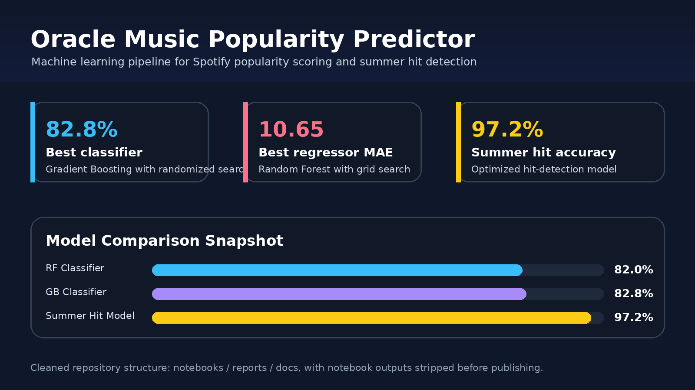
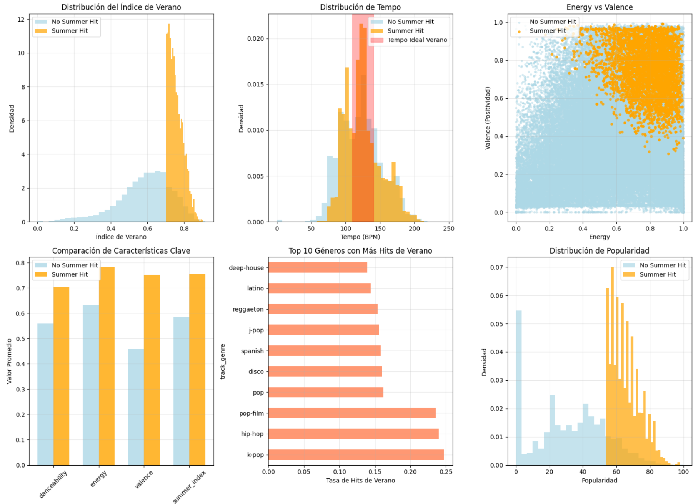

# 🎵 Oracle Music Popularity Predictor

Machine learning project for predicting song popularity and identifying potential summer hits from Spotify-style audio features. This was built as a collaborative hackathon project and reached **3rd place** in the Oracle challenge.



---

## 🚀 Project Overview

The goal was to turn a music dataset into a practical prediction pipeline with two complementary tasks:

- **Popularity prediction:** estimate whether a song is likely to be popular and predict its popularity score.
- **Summer hit detection:** identify tracks with the strongest potential to become seasonal summer hits.

The notebook compares multiple supervised learning approaches, evaluates classification and regression performance, and derives custom features designed around energetic, danceable and radio-friendly songs.

---

## 🧠 What The Pipeline Does

- Loads and explores a Spotify-style training dataset.
- Cleans non-predictive metadata such as track IDs, names and artist text fields.
- Encodes categorical variables such as genre and explicit-content flags.
- Builds both classification and regression targets from the popularity score.
- Compares Random Forest and Gradient Boosting models.
- Runs Grid Search and Random Search for hyperparameter tuning.
- Builds a specialized summer-hit score using engineered music features.
- Reports accuracy, precision, F1-score, MAE and RMSE.



---

## 📊 Results Snapshot

| Task | Best Approach | Metric |
|---|---|---:|
| Popularity classification | Gradient Boosting Classifier + Random Search | 82.8% accuracy |
| Popularity regression | Random Forest Regressor + Grid Search | 10.65 MAE |
| Summer hit detection | Optimized Gradient Boosting model | 97.2% accuracy |

The summer-hit model reached high accuracy, although F1-score remains the more important signal when the positive class is scarce. In other words: accuracy alone can look strong if true hits are rare, so precision/recall tradeoffs still matter.

---

## 🎧 Feature Engineering

The project uses both original audio features and custom indicators for seasonal hit potential:

- `summer_index`: composite score for summer-like tracks.
- `energy_valence_ratio`: relationship between energy and positivity.
- `dance_energy_combo`: combined danceability and energy signal.
- `positive_dance_factor`: positive and danceable track indicator.
- `radio_friendly_duration`: duration range more suitable for radio play.

Top signals observed during the project included genre, summer index, acousticness, duration and loudness.

---

## 🏗️ Repository Structure

```text
.
├── data/raw/                                  # Place train.csv here
├── docs/                                      # Extra notes, if needed
├── models/                                    # Generated model artifacts
├── notebooks/music_popularity_prediction_pipeline.ipynb
├── reports/figures/                           # README figures and visual assets
├── reports/tables/                            # Generated metrics and feature tables
├── requirements.txt
├── LICENSE
└── README.md
```

---

## ⚙️ How To Run

Install dependencies:

```bash
pip install -r requirements.txt
```

Place the dataset here:

```text
data/raw/train.csv
```

Then open and run:

```text
notebooks/music_popularity_prediction_pipeline.ipynb
```

The dataset is not included in this repository. The notebook expects a Spotify-style CSV with fields such as `popularity`, `track_genre`, `danceability`, `energy`, `valence`, `acousticness`, `duration_ms` and `loudness`.

---

## 🛠️ Tech Stack

- Python
- pandas
- NumPy
- scikit-learn
- Matplotlib
- Seaborn
- Jupyter Notebook

---

## 👥 Credits

This project was developed collaboratively as a team submission for the **Oracle music popularity hackathon challenge**.

Team members:

- Brian Polo
- Juan Diego Bermúdez
- Roberto Sánchez

---

## 🧩 Notes

This repository has been cleaned for publication: notebook outputs were stripped to avoid leaking local paths, the dataset folder is prepared but empty, and generated figures are stored under `reports/figures`.
